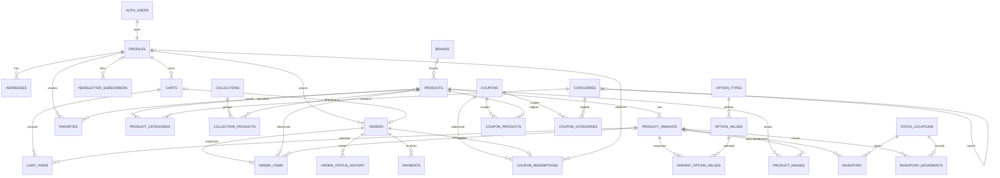

# Diagrama ER — domínio do e-commerce

```mermaid
erDiagram
  AUTH_USERS ||--|| PROFILES : owns
  PROFILES ||--o{ ADDRESSES : has
  PROFILES ||--o{ CARTS : owns
  PROFILES ||--o{ ORDERS : places
  PROFILES ||--o{ FAVORITES : creates
  PROFILES o|--o{ NEWSLETTER_SUBSCRIBERS : links

  CATEGORIES o|--o{ CATEGORIES : parent
  BRANDS o|--o{ PRODUCTS : brands
  PRODUCTS ||--o{ PRODUCT_CATEGORIES : classified
  CATEGORIES ||--o{ PRODUCT_CATEGORIES : contains
  COLLECTIONS ||--o{ COLLECTION_PRODUCTS : groups
  PRODUCTS ||--o{ COLLECTION_PRODUCTS : appears
  PRODUCTS ||--|{ PRODUCT_VARIANTS : has
  OPTION_TYPES ||--o{ OPTION_VALUES : defines
  PRODUCT_VARIANTS ||--o{ VARIANT_OPTION_VALUES : composes
  OPTION_VALUES ||--o{ VARIANT_OPTION_VALUES : selected
  PRODUCTS ||--o{ PRODUCT_IMAGES : shows
  PRODUCT_VARIANTS o|--o{ PRODUCT_IMAGES : specializes

  PRODUCT_VARIANTS ||--o{ INVENTORY : stocked
  STOCK_LOCATIONS ||--o{ INVENTORY : stores
  PRODUCT_VARIANTS ||--o{ INVENTORY_MOVEMENTS : moves
  STOCK_LOCATIONS ||--o{ INVENTORY_MOVEMENTS : records

  CARTS ||--o{ CART_ITEMS : contains
  PRODUCT_VARIANTS ||--o{ CART_ITEMS : selected

  CARTS o|--o| ORDERS : converts
  ORDERS ||--|{ ORDER_ITEMS : snapshots
  PRODUCTS o|--o{ ORDER_ITEMS : references
  PRODUCT_VARIANTS o|--o{ ORDER_ITEMS : references
  ORDERS ||--o{ ORDER_STATUS_HISTORY : tracks
  ORDERS ||--o{ PAYMENTS : receives

  COUPONS ||--o{ COUPON_PRODUCTS : scopes
  PRODUCTS ||--o{ COUPON_PRODUCTS : eligible
  COUPONS ||--o{ COUPON_CATEGORIES : scopes
  CATEGORIES ||--o{ COUPON_CATEGORIES : eligible
  COUPONS ||--o{ COUPON_REDEMPTIONS : redeemed
  ORDERS ||--o| COUPON_REDEMPTIONS : applies
  PRODUCTS ||--o{ FAVORITES : saved
  PROFILES o|--o{ COUPON_REDEMPTIONS : redeems
```
